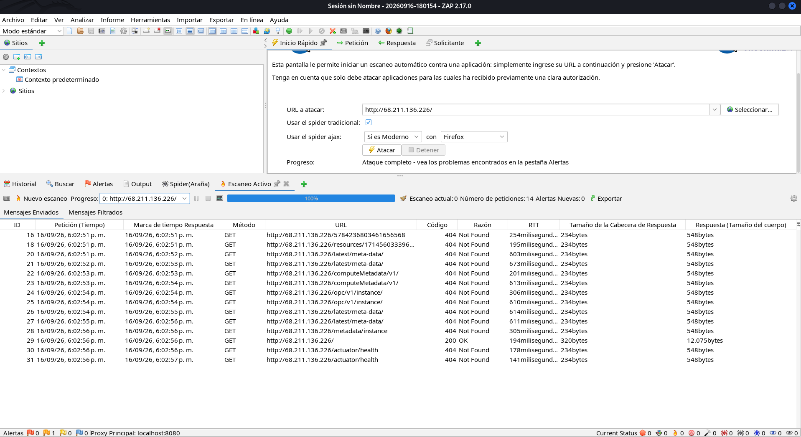

# Reporte de Inspección Pasiva OWASP ZAP (Paso 10)

## 1. Procedimiento de Ejecución
Conforme a las reglas de la **Fase C (Paso 10)**:
1. Se abrió OWASP ZAP (v2.17.0) en la estación de pruebas y se utilizó **Manual Explore**.
2. Se ingresó como único objetivo la URL autorizada: `http://68.211.136.226/`.
3. Se navegó por la página principal y los recursos estáticos vinculados.
4. Se revisó la pestaña de **Alertas** e historial HTTP **sin ejecutar Active Scan** (para no generar ruido ni escaneos intrusivos no autorizados).

## 2. Evidencia Gráfica de la Sesión
La sesión de ZAP fue capturada en el archivo:
- `reports/zap-passive/zap_session_screenshot.png` (Sesión `20260916-180154`, ZAP 2.17.0).

## 3. Hallazgos Pasivos y Registro de Observaciones

| ID Hallazgo | Alerta Pasiva | Severidad | Mapeo de Riesgo | Observación / Impacto |
|---|---|---|---|---|
| **ZAP-01** | Missing Anti-Clickjacking Header (`X-Frame-Options`) | Media | R3 / H2 | La aplicación no restringe si puede ser renderizada dentro de un marco (`<frame>`, `<iframe>`). Corregido con `add_header X-Frame-Options "DENY" always;`. |
| **ZAP-02** | X-Content-Type-Options Header Missing | Baja | R3 / H2 | Ausencia de `nosniff`. Un navegador podría intentar inferir el tipo MIME de los recursos. Corregido con `add_header X-Content-Type-Options "nosniff" always;`. |
| **ZAP-03** | Server Leaks Version via "Server" Header | Informativa | R2 / H2 | Se filtraba `nginx/1.24.0 (Ubuntu)`. Corregido con `server_tokens off;`. |
| **ZAP-04** | Tráfico HTTP en texto plano | Informativa | R1 / H1, H4 | Falta de cifrado TLS (abierto deliberadamente para resolver con HTTPS en Lab 4). |

## 4. Conclusión del Análisis Pasivo
Conforme a la guía del laboratorio, estas alertas pasivas no representan vulnerabilidades críticas de ejecución remota, sino debilidades en la postura de **hardening HTTP**. Todas las observaciones relacionadas con cabeceras ausentes y fuga de versión fueron trasladadas al Blue Team para su mitigación en el **Paso 15** mediante la configuración de Nginx.
